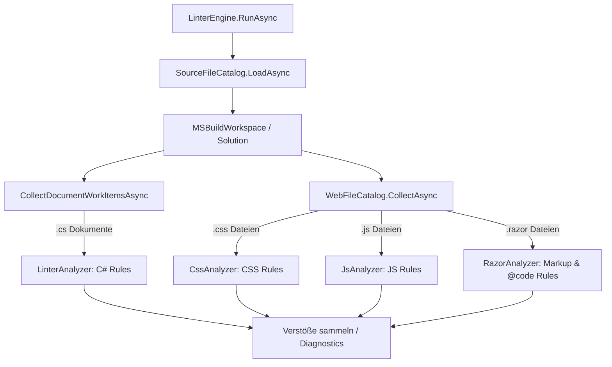

# Erweiterung von AiNetLinter um Web-Assets (Razor, CSS, JS)

Dieses Forschungsdokument beschreibt die globale Architektur und das Integrationskonzept zur Erweiterung von `AiNetLinter` um Web-Assets, die typischerweise in Blazor- und ASP.NET Core-Projekten vorkommen.

---

## 1. Intention & Motivation (AI-Readability Context)

Beim autonomen Editieren von Web-Applikationen durch KI-Agenten treten häufig die gleichen Fehlerklassen auf wie bei C#-Codebasen:

* **"Lost in the Middle":** Lange CSS-Dateien (>300 Zeilen) oder verschachtelte Razor-Markup-Strukturen führen dazu, dass LLMs beim Erzeugen von Diffs Logik-Blöcke überschreiben oder schließen.
* **Butterfly Effect (Seiteneffekte):** KIs können die globalen UI-Auswirkungen einer CSS-Klassenänderung in einer monolithischen `app.css` nicht vorhersagen. Scoped CSS (`.razor.css`) isoliert den Code lokal und macht die Code-Änderung für die KI sicher berechenbar.
* **Syntax-Fehler in Strings/Templates:** Komplexe C#-Inline-Lambdas innerhalb von HTML-Events (wie `@onclick="..."`) verführen KIs zu Syntaxfehlern.

---

## 2. Architektur & Integrations-Konzept

### 2.1 Überblick

`AiNetLinter` lädt die Solution bereits vollständig über den `MSBuildWorkspace` in `SourceFileCatalog`. Roslyn's `project.Documents` enthält ausschließlich `.cs`-Dateien — CSS, JS und Razor sind dort **nicht** sichtbar.

Web-Dateien benötigen daher einen **parallelen Discovery-Pfad**: den neuen `WebFileCatalog`. Er nutzt die bereits geladene `Solution` (kein zweites MSBuild-Laden) und enumeriert Projektverzeichnisse per Dateisystem-Walk.



### 2.2 WebFileCatalog

Der `WebFileCatalog` ist eine neue, schlanke Klasse im Namespace `AiNetLinter.Web`:

```csharp
public sealed class WebFileCatalog
{
    /// <summary>
    /// Enumeriert alle Web-Dateien aus den Projektverzeichnissen der Solution.
    /// Filtert ExemptPaths und generierte Verzeichnisse (obj/, bin/) heraus.
    /// </summary>
    public static IReadOnlyList<WebFileEntry> Collect(
        Solution solution,
        WebConfig config)
    {
        var solutionDir = Path.GetDirectoryName(solution.FilePath)!;
        var entries = new List<WebFileEntry>();

        foreach (var project in solution.Projects)
        {
            var projectDir = Path.GetDirectoryName(project.FilePath);
            if (projectDir == null) continue;

            CollectFromDirectory(projectDir, solutionDir, config, entries);
        }

        return entries;
    }

    private static void CollectFromDirectory(
        string projectDir,
        string solutionDir,
        WebConfig config,
        List<WebFileEntry> entries)
    {
        foreach (var filePath in Directory.EnumerateFiles(projectDir, "*", SearchOption.AllDirectories))
        {
            if (IsGeneratedPath(filePath)) continue;
            var relativeToSolution = Path.GetRelativePath(solutionDir, filePath);
            if (IsExemptPath(relativeToSolution, config)) continue;

            var type = GetWebFileType(filePath);
            if (type == null) continue;

            entries.Add(new WebFileEntry(filePath, relativeToSolution, type.Value));
        }
    }

    private static bool IsGeneratedPath(string path) =>
        path.Contains($"{Path.DirectorySeparatorChar}obj{Path.DirectorySeparatorChar}") ||
        path.Contains($"{Path.DirectorySeparatorChar}bin{Path.DirectorySeparatorChar}") ||
        path.Contains($"{Path.DirectorySeparatorChar}node_modules{Path.DirectorySeparatorChar}");

    private static bool IsExemptPath(string relativePath, WebConfig config)
    {
        // Glob-Matching gegen ExemptPaths aus CSS-, JS- und Razor-Config
        // Nutzt den bestehenden FileFilterEvaluator des Projekts
        return config.Css.ExemptPaths.Any(p => FileFilterEvaluator.Matches(relativePath, p))
            || config.Js.ExemptPaths.Any(p => FileFilterEvaluator.Matches(relativePath, p));
    }

    private static WebFileType? GetWebFileType(string path) =>
        Path.GetExtension(path).ToLowerInvariant() switch
        {
            ".css" => WebFileType.Css,
            ".js"  => WebFileType.Js,
            ".razor" => WebFileType.Razor,
            _ => null
        };
}

public record WebFileEntry(string AbsolutePath, string RelativePath, WebFileType Type);

public enum WebFileType { Css, Js, Razor }
```

### 2.3 Integration in LinterEngine

Nach der bestehenden Roslyn-Analyse fügt `LinterEngine.RunAsync` einen zweiten Block hinzu:

```csharp
// Bestehend: C# Analyse
var csViolations = await RunCSharpAnalysisAsync(catalog, config, ct);

// Neu: Web-Analyse (nur wenn Web-Sektion in rules.json aktiv)
var webViolations = config.Web.IsEnabled
    ? await RunWebAnalysisAsync(catalog.Solution, config.Web, ct)
    : [];

var allViolations = csViolations.Concat(webViolations).ToList();
```

---

## 3. Generelle Unterdrückungs-Strategie (Suppression)

Wie bei C#-Dateien (`// ainetlinter-disable [RuleId]`) können Entwickler und KIs Warnungen gezielt unterdrücken.

| Dateityp | Syntax | Beispiel |
| :--- | :--- | :--- |
| **CSS** | `/* ainetlinter-disable RuleId */` | `/* ainetlinter-disable CSS_MaxCssLineCount */` |
| **JavaScript** | `// ainetlinter-disable RuleId` | `// ainetlinter-disable JS_MaxJsLineCount */` |
| **Razor** | `@* ainetlinter-disable RuleId *@` | `@* ainetlinter-disable RAZOR_MaxMarkupNestingDepth *@` |

**Hinweis Razor-Suppression-Syntax:** Für `.razor`-Dateien wird die Razor-eigene Kommentar-Syntax (`@* ... *@`) verwendet, nicht HTML-Kommentare (`<!-- -->`). Grund: HTML-Kommentare werden von Blazor als Markup gerendert; Razor-Kommentare sind compiler-seitig unsichtbar. Diese Syntax ist konsistent mit der bestehenden Epic-22-Suppression ([configuration.md](../Docs/configuration.md)).

Die Implementierung prüft beim Einlesen der Datei, ob der Deaktivierungs-Kommentar am Dateianfang (dateiweite Suppression) oder oberhalb der betroffenen Zeile vorhanden ist.

---

## 4. Erweiterung der `rules.json`

Die `rules.json` wird um eine neue `Web`-Sektion ergänzt. Der bestehende `LinterConfigSyncer` ergänzt fehlende Sektionen automatisch mit Standardwerten; bestehende Nutzer-Werte bleiben erhalten.

```json
{
  "Global": {
    "EnforceSealedClasses": true
  },
  "Web": {
    "IsEnabled": true,
    "Css": {
      "MaxCssLineCount": 300,
      "PreferScopedCss": true,
      "PreferScopedCssMinRuleCount": 5,
      "MaxCssSelectorComplexity": 3,
      "ExemptPaths": ["**/wwwroot/lib/**", "**/node_modules/**", "**/*.min.css"]
    },
    "Js": {
      "MaxJsLineCount": 150,
      "EnforceJsModules": true,
      "ExemptPaths": ["**/wwwroot/lib/**", "**/node_modules/**", "**/*.min.js"]
    },
    "Razor": {
      "MaxRazorLineCount": 300,
      "MaxRazorCodeBlockLines": 60,
      "BanInlineEventLambdas": true,
      "MaxMarkupNestingDepth": 6
    }
  },
  "Metrics": {
    "MaxLineCount": 500
  }
}
```

Die detaillierten Regel-Spezifikationen:
* [01_CSS_Linting.md](01_CSS_Linting.md)
* [02_JS_Linting.md](02_JS_Linting.md)
* [03_Razor_Linting.md](03_Razor_Linting.md)

---

## 5. Abgrenzung zu Epic 22 (BlazorRequireCodeBehind / BlazorRequireCssIsolation)

Epic 22 prüft **Struktur** (hat die Datei die richtigen Begleitdateien?):
- `BlazorRequireCodeBehind`: Jede `.razor`-Datei muss eine `.razor.cs` haben.
- `BlazorRequireCssIsolation`: Jede `.razor`-Datei muss eine `.razor.css` haben.

Die neuen Web-Regeln prüfen **Inhalt** (was steht in den Dateien?):
- `RAZOR_MaxRazorLineCount`: Wie lang ist die Datei?
- `CSS_MaxCssLineCount`: Wie viele Zeilen hat die CSS-Datei?
- usw.

Beide Ebenen sind komplementär. Ein Projekt mit korrekt strukturierten Begleitdateien (Epic 22 zufrieden) kann trotzdem zu große oder zu komplexe Inhalte haben (neue Regeln).

---

## 6. Implementierungsphasen

| Phase | Umfang | Neue NuGet-Pakete | Komplexität |
| :--- | :--- | :--- | :--- |
| **1 — CSS** | `WebFileCatalog`, `CssAnalyzer`, 3 CSS-Regeln | `ExCSS` | Gering |
| **2 — JS** | `JsAnalyzer`, 2 JS-Regeln | `Esprima.NET` | Mittel |
| **3 — Razor** | `RazorAnalyzer`, 4 Razor-Regeln, @code-C#-Kopplung | `Microsoft.AspNetCore.Razor.Language` | Hoch |

**Phase 3 darf erst beginnen**, wenn die @code-Block-Extraktion und die Zeilennummern-Übersetzung (→ [03_Razor_Linting.md](03_Razor_Linting.md)) in einem Proof-of-Concept validiert wurden. Die Korrektheit der gemeldeten Zeilennummern ist ein Go/No-Go-Kriterium.
