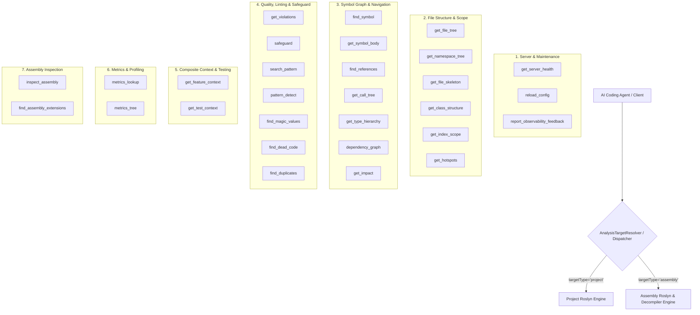

# 360-Grad-Audit: Gesamtsystem & MCP-Tool-Suite (29 Tools)

## Überblick & Architektur

AiNetLinter stellt eine hochspezialisierte Suite aus **29 MCP-Tools** bereit, die in sechs funktionale Domänen unterteilt sind:

---

## 360-Grad-Matrix aller 29 MCP-Tools

| Nr. | MCP-Tool | Domäne | Target: Project | Target: Assembly | Getestet & Verifiziert | Status / Befund-Zusammenfassung |
|---|---|---|:---:|:---:|:---:|---|
| 1 | `get_server_health` | Maintenance | Ja | Ja (optional) | Ja | **Bug P1:** Proxy-Modus scheitert mit `PROJECT_NOT_INITIALIZED` bei gezieltem Projektpfad vor lokalem Zugriff. |
| 2 | `reload_config` | Maintenance | Ja | Nein | Ja | Einwandfrei; liefert Vorher-/Nachher-Delta von `rules.json`. |
| 3 | `report_observability_feedback` | Maintenance | Global | Global | Ja | Funktional; schreibt strukturierte Observability-Logs. |
| 4 | `get_file_tree` | File Structure | Ja | Nein | Ja | Extrem schnell (<50ms); hervorragende `summary`/`tree`/`files`-Ansichten. |
| 5 | `get_namespace_tree` | File Structure | Ja | Ja | Ja | **Bug P3:** Zeigt bei Assembly-Zielen irreführenden `# Solution Overview`-Header. |
| 6 | `get_file_skeleton` | File Structure | Ja | Ja | Ja | Funktional; **Bug P1:** Erzeugte DocCommentIds weichen bei unvollständigen Compilations von semantischen IDs ab. |
| 7 | `get_class_structure` | File Structure | Ja | Ja | Ja | Hervorragende Tabellenübersicht aller Typ-Member mit Zeilenbereichen und Signaturen. |
| 8 | `get_index_scope` | File Structure | Ja | Nein | Ja | Liefert saubere Aufschlüsselung über 886 `.cs`-Dateien im Symbolgraphen. |
| 9 | `get_hotspots` | File Structure | Ja | Nein | Ja | Präzise Lokalisierung von Dateien nahe dem Zeilenlimit (>=80% / >=95%). |
| 10 | `find_symbol` | Symbol Graph | Ja | Ja | Ja | Mächtige Regex- und Batch-Suche; `includeReferences` steuert Referenz-Assemblies. |
| 11 | `get_symbol_body` | Symbol Graph | Ja | Ja | Ja | **Bug P1:** Wirft `InvalidOperationException` bei Top-Level-Klassen in dekompilierten Snapshots. |
| 12 | `find_references` | Symbol Graph | Ja | Ja | Ja | **Bug P2:** Gibt irreführenden `McpSufficiencyHints`-Vollständigkeitshinweis bei dekompilierten Snapshots ohne Rümpfe. |
| 13 | `get_call_tree` | Symbol Graph | Ja | Ja | Ja | Transitive Call-Graph-Traversierung mit Bounded-Depth (1–3) und Zyklenerkennung. |
| 14 | `get_type_hierarchy` | Symbol Graph | Ja | Ja | Ja | Unterstützt Basisklassen, abgeleitete Klassen und Interface-Implementierungen. |
| 15 | `dependency_graph` | Symbol Graph | Ja | Ja | Ja | Liefert gerichtete Abhängigkeitsstrukturen mit Zyklenerkennung. |
| 16 | `get_impact` | Symbol Graph | Ja | Nein | Ja | **Missing Feature P2:** Symbol-Impact (`symbolIdentifier`) für Assembly-Targets nicht freigeschaltet. |
| 17 | `get_violations` | Quality & Linting | Ja | Nein | Ja | **Dogfooding P2:** Findet 5 `AIContextFootprint`-Warnungen in den neuen Assembly-Coordinators. |
| 18 | `safeguard` | Quality & Linting | Ja | Nein | Ja | Aggregierter Architektur-Score (2,65/10) mit priorisierter Refactoring-Guidance. |
| 19 | `search_pattern` | Quality & Linting | Ja | Nein | Ja | Schneller semantischer Pattern-Scanner für Code-Muster. |
| 20 | `pattern_detect` | Quality & Linting | Ja | Nein | Ja | Erkennung von God-Classes, Async-Void, Long-Methods, Empty-Catch, Feature-Envy. |
| 21 | `find_magic_values` | Quality & Linting | Ja | Nein | Ja | Klassifizierung von Literalen in Konstanten-, Format-String-, Lokalisierungs- und Nameof-Kandidaten. |
| 22 | `find_dead_code` | Quality & Linting | Ja | Nein | Ja | Heuristische Erkennung ungenutzter Methoden/Felder mit Framework- und Visibility-Limits. |
| 23 | `find_duplicates` | Quality & Linting | Ja | Nein | Ja | Exakte und Near-Duplicate-Erkennung mit Ähnlichkeits-Score (z.B. Score 0,95). |
| 24 | `get_feature_context` | Composite Context | Ja | Nein | Ja | Aggregiert Symbol-Details, Budget, Metriken, direkte Aufrufer, Tests und offene Violations. |
| 25 | `get_test_context` | Composite Context | Ja | Nein | Ja | Statische Test-Zuordnung über Naming-Conventions und `@covers`-Tags inklusive `dotnet test`-Filterbefehl. |
| 26 | `metrics_lookup` | Metrics | Ja | Ja | Ja | Schwellwertabgleich für LOC, AI-Context-Footprint und Public Members pro Typ/Methode. |
| 27 | `metrics_tree` | Metrics | Ja | Ja | Ja | Hierarchischer LoC- und Dateibaum über Projektverzeichnisse (`code_size`, `complexity`, etc.). |
| 28 | `inspect_assembly` | Assembly Specific | Nein | Ja | Ja | 8-KB-Response-Budget, Typen-/Namespace-Zusammenfassung; **Optimierung P2:** Namespace-Flut verdrängt Typen. |
| 29 | `find_assembly_extensions` | Assembly Specific | Nein | Ja | Ja | **Optimierung P2:** Erzwingt immer `ExpandAssemblyReferences: true` ohne Opt-out. |

---

## Kernstärken des Gesamtsystems

1. **Konsequente Progressive Disclosure:** Tools wie `get_file_tree`, `get_hotspots`, `get_namespace_tree` und `metrics_tree` ermöglichen extrem schnelles Erfassen großer Repositories (886 Dateien, 133.000 LoC in <1 Sekunde) mit feingranularen Drilldown-Pfaden.
2. **Roslyn-basierte Semantik:** Symbolauflösung, Aufrufgraphen, Vererbung und Metriken arbeiten auf echten Roslyn-Syntaxbäumen und Symbolmodellen — weit überlegen gegenüber reinem Regex/Grep.
3. **Fail-Closed-Sicherheit:** Native Binärdateien, ungültige Pfade, Reparse-Points und fehlerhafte Argumente werden strukturiert, isoliert und ohne Prozess- oder Host-Absturz abgefangen.
4. **Residente Caching- & Daemon-Architektur:** Schnelle Wiederholabfragen (<5ms) durch resident gehaltene Roslyn-Snapshots und Named-Pipe-Daemon.
