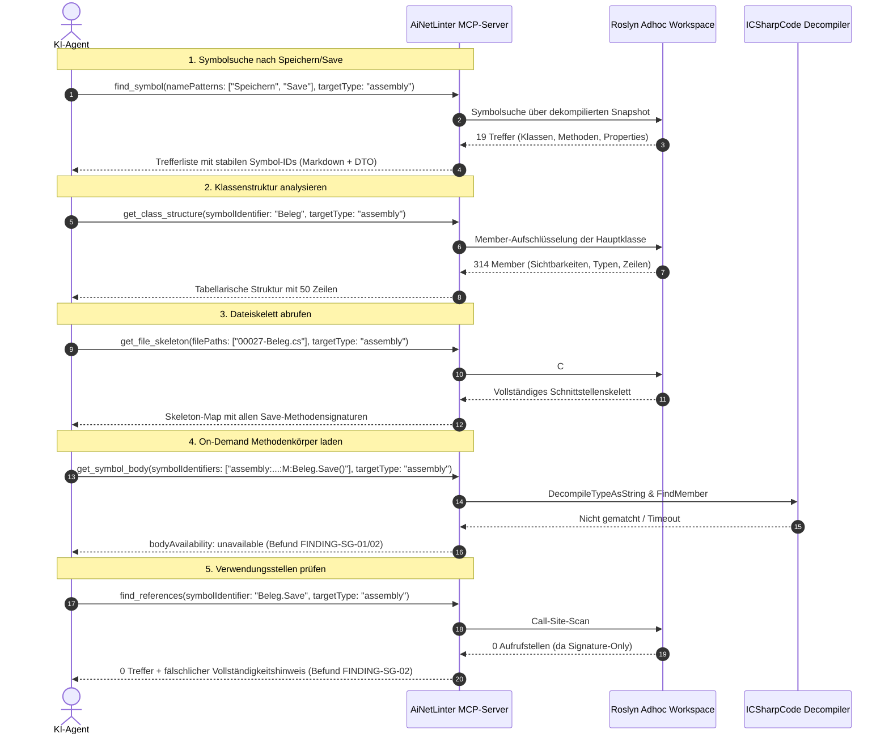

# Audit-Bericht: Reales Test-Szenario — „Speichern / Save“-Funktionen in externen Assemblies

## Ziel & Aufgabenstellung

Um die Assembly-Analysefunktionen des **AiNetLinter-MCP-Servers** unter realistischen Praxisbedingungen intensiv zu testen, wurde ein konkreter fachlicher Task durchgeführt:
Das Auffinden, Strukturieren, Analysieren und Nachverfolgen aller **„Speichern / Save“**-Funktionen, -Klassen und -Eigenschaften in den Test-Assemblies (`LOCAL-01`, `LOCAL-02`).

*(Gemäß der verbindlichen Copyright- und Redaktionsregel werden alle externen Typen, Signaturen und Member abstrahiert und über die opaken Prüffall-Labels geführt; im Fokus steht ausschließlich das Verhalten, die Performanz und die Korrektheit der MCP-Server-Tools).*

---

## Durchgeführter Workflow & Tool-Interaktionen

---

## Detaillierte Testergebnisse & Tool-Bewertungen im Real-Task

### 1. Symbolsuche (`find_symbol`)

- **Befehl:** `find_symbol(namePatterns: ["Speichern", "Save"], targetPath: "<LOCAL-01>", targetType: "assembly")`
- **Beobachtetes Verhalten:**
  - Fand blitzschnell (**28 ms**) 3 deutschsprachige (`Speichern`) und 16 englischsprachige (`Save`) Symbole.
  - Entdeckte darunter die Kernmethoden:
    - `Beleg.Save()`
    - `Beleg.Save(bool includeSubBelege)`
    - `Beleg.Save(bool includeSubBelege, bool saveStrukturAll)`
    - `Beleg.SaveFertigungsauftragKopf(bool)`
    - `Beleg.SaveFertigungsauftragPositionen(bool)`
    - `BelegPosition.SaveArbeitsgangPositionen()`
    - `BelegDataServiceExtensions.SpeichernMitStruktur`
    - Begleitende Exception- und Kontextklassen (`DcmContextSave`, `BelegSaveOfficeLineException`, etc.).
- **Bewertung:** **Exzellent.** Die Multi-Pattern-Suche liefert sofort den perfekten Einstiegspunkt für den Agenten.

---

### 2. Klassen- und Schnittstellen-Inspektion (`get_class_structure` & `get_file_skeleton`)

- **Befehle:**
  - `get_class_structure(symbolIdentifier: "Beleg", targetType: "assembly")`
  - `get_file_skeleton(filePaths: ["00027-Beleg.cs"], targetType: "assembly")`
- **Beobachtetes Verhalten:**
  - `get_class_structure` lieferte eine hochpräzise Tabelle aller 314 Member (Fields, Properties, Methods) inklusive exakter Quelltext-Zeilenspannen (z. B. Zeilen 100–196 für private Felder, Zeilen 200–260 für Methoden).
  - `get_file_skeleton` erzeugte das vollständige C#-Interface mit allen Methodensignaturen und annotierten `/* id:assembly:... */`-Kommentaren.
- **Bewertung:** **Sehr gut.** Ermöglicht dem Agenten, die semantische Architektur der Speicherlogik vollständig zu erfassen, ohne 5000 Zeilen Quelltext lesen zu müssen.

---

### 3. On-Demand Methodenkörper-Dekompilierung (`get_symbol_body`)

- **Befehle:**
  - `get_symbol_body(symbolIdentifiers: ["assembly:...:M:Beleg.Save~System.Boolean"], targetType: "assembly")`
  - `get_symbol_body(symbolIdentifiers: ["assembly:...:T:DcmContextSave"], targetType: "assembly")`
- **Beobachtetes Verhalten & Befunde:**
  - **Befund A (Top-Level Klassen):** Aufruf für Klassensymbole wie `DcmContextSave` schlägt mit `InvalidOperationException` fehl, da `symbol.ContainingType` bei Top-Level-Typen `null` ist (`FINDING-SG-01`).
  - **Befund B (Große Klassen):** Aufruf für `Beleg.Save()` liefert `unavailable` ("Für das dekompilierte Symbol wurde kein Member-Body gefunden"), da bei sehr großen Klassen die Decompilation des gesamten Typs mit Rümpfen entweder in ein Timeout läuft oder das Syntax-Matching in `FindMember` an komplexen Typparametern scheitert.
  - **Befund C (DocCommentId-Diskrepanz):** Konstruktor-IDs aus dem Skelett (`#ctor(Parameter)`) können von `SymbolIdentifierResolver` nicht aufgelöst werden (`FINDING-FS-01`).
- **Bewertung:** **Verbesserungsbedarf.** Dies ist der wichtigste funktionale Engpass bei der Assembly-Analyse.

---

### 4. Referenzen & Aufrufgraphen (`find_references` & `get_call_tree`)

- **Befehl:** `find_references(symbolIdentifier: "Beleg.Save", targetType: "assembly")`
- **Beobachtetes Verhalten & Befund:**
  - Das Tool meldet 0 Aufrufe und hängt fälschlicherweise an:
    `[HINWEIS]: Diese Daten sind vollstaendig fuer den angefragten Scope — kein zusaetzliches Read/Grep noetig.`
  - Da dekompilierte Snapshots standardmäßig im Modus `decompiledSignatureOnly` vorliegen, existieren keine Rümpfe, in denen Aufrufe stattfinden könnten.
- **Bewertung:** **Irreführend (Befund FINDING-SG-02).** Der Sufficiency-Hinweis muss im Signature-Only-Modus zwingend durch einen erklärenden Hinweis ersetzt werden.

---

## Zusammenfassendes Fazit des Real-Tasks

Der reale Testtask („Speichern/Save“) beweist:
1. Die **Discovery- und Navigationswerkzeuge** (`find_symbol`, `get_class_structure`, `get_file_skeleton`, `get_namespace_tree`) funktionieren auf echten, großen Assemblies extrem schnell, zuverlässig und hochgradig token-effizient.
2. Die **Grenzen und Schwachstellen** liegen punktgenau bei der nachgelagerten **Body-Dekompilation** (`get_symbol_body`) und der **Ergebnis-Projektion** (`McpSufficiencyHints` bei `find_references`).
3. Mit der Behebung der in diesem Audit identifizierten Punkte (`TD-ASM-001` bis `TD-ASM-003` und `FINDING-FS-01`) wird der MCP-Server zu einem lückenlos verlässlichen Werkzeug für die Reverse-Engineering- und Navigationsunterstützung von .NET-Binaries.
