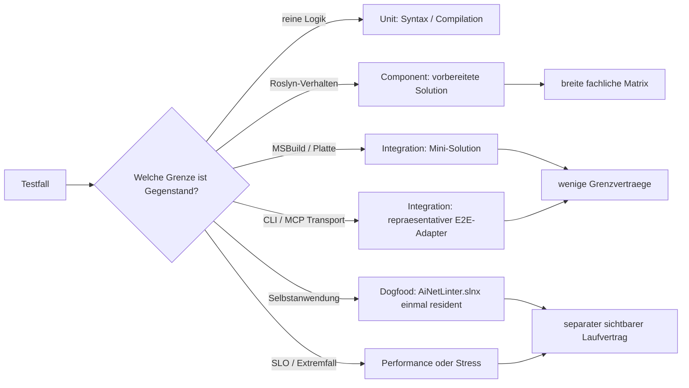

# Konzept: Tests beschleunigen, ohne Leitplanken abzubauen

## Kurzfassung

Die Tests sind nicht primaer langsam, weil AiNetLinter besonders viel Fachlogik prueft, sondern weil
dieselbe teure Infrastruktur zu oft erneut aufgebaut wird. Im vorhandenen Bestand werden kleine
Roslyn-Fragen, Filtermatrizen, CLI-Verhalten, MCP-Transport und echtes Dogfooding teilweise auf
derselben teuersten Ebene getestet: Solution von Platte finden, `MSBuildWorkspace` erzeugen,
Solution laden, Compilations aufbauen und zum Teil noch einen Prozess starten.

Das Ziel ist eine verbindliche Testpyramide mit einer gemeinsamen Testplattform:

1. **Unit:** reine Logik, Syntax und kleine Compilations ohne MSBuild, Prozess oder Repository.
2. **Component:** vorbereitete immutable Roslyn-`Solution`-Snapshots im Speicher; hier liegt die
   breite fachliche Testmatrix.
3. **Integration:** kleine reale `.slnx`-Fixtures pruefen gezielt den Vertrag zu MSBuild,
   Dateisystem, CLI und MCP-Transport.
4. **Dogfood / Performance / Stress:** pruefen weiterhin das echte Repository bzw. definierte Last,
   erhalten aber einen sichtbaren eigenen Laufvertrag.

Die Testabdeckung wird nicht pauschal reduziert. Stattdessen wird jede Assertion auf der
guenstigsten Ebene ausgefuehrt, die ihren eigentlichen Vertrag noch real prueft. Wiederholtes Laden
derselben Solution wird ueber langlebige Fixtures und injizierbare `Solution`-/Analyse-Input-
Einstiegspunkte vermieden. Mutable Datei- und Refresh-Szenarien bleiben isoliert und teilen keinen
veraenderlichen Workspace.

## Verbindliche Entscheidungen aus der Konzeptklaerung

- Der normale Entwickler-/PR-Lauf umfasst `Unit + Component + hermetische Integration`.
  Vollstaendiges Dogfood, Performance und Stress bleiben verpflichtend, laufen aber in eigenen
  Profilen/Cadences; am Ende dieses Refactoring-Tasks werden alle Profile einmal nachgewiesen.
- Die Testgrenzen werden physisch getrennt: eine schnelle Test-Assembly fuer Unit/Component und
  eine Infrastruktur-Test-Assembly fuer Integration/Dogfood/Performance/Stress. Gemeinsame
  Builder und Fixtures erhalten eine kleine TestKit-Heimat ohne eigene Testsammlung.
- Es gibt kein hartes absolutes Sekunden-SLO, weil Fremdlast auf der Maschine das Ergebnis
  verfaelschen kann. Abnahmegrundlage sind strukturelle Invarianten und ein wiederholter relativer
  Vorher-/Nachher-Nachweis unter dokumentierten Bedingungen.
- Die heutige Anzahl und Identitaet einzelner Testmethoden ist keine Invariante. Redundante oder
  triviale Tests duerfen konsolidiert bzw. entfernt werden; alle nicht-trivialen fachlichen,
  technischen und regressionsrelevanten Vertraege muessen lueckenlos abgedeckt bleiben.
- Das Legacy-Projekt wird erst nach Aufbau einer definierten **Minimum Safety Envelope** aus dem
  normalen Solution-/Gate-Pfad entfernt. Ein einzelner Smoke waere dafuer zu schwach. Migrierte
  Tests werden im selben Kohorten-Step physisch geloescht, nicht auskommentiert; die Git-Historie
  ist das Archiv.
- Vor der Uebernahme einer Kohorte darf ihr engster Legacy-Filter einmal als Verhaltensbaseline
  laufen, wenn vorhandene TRX-Daten nicht ausreichen. Ein Legacy-Volllauf findet waehrend der
  Migration nicht statt.
- Die Migration ist zugleich ein Coverage-Audit: neue Tests sind ausdruecklich erwuenscht, wenn
  bislang ungeschuetzte nicht-triviale Vertraege entdeckt werden; redundante oder falsch
  geschnittene Tests werden konsolidiert.
- Die spaetere Drift-Loop-Umsetzung verwendet wenige grosse, vertikale Steps. Dokuzeilen,
  Einzelklassen oder einzelne Testverschiebungen werden nicht als eigene Steps geplant, sondern
  zusammen mit einem vollstaendigen Architektur-/Testkohorten-Ergebnis geliefert.

## Senior-Testreview: erkannte Konzeptfehler und Korrekturen

Das Konzept wurde bewusst aus Gegenposition geprueft. Folgende Punkte waren zu optimistisch oder
unvollstaendig und sind mit dieser Runde verbindlich korrigiert:

1. **Shared Fixture ist nicht automatisch schneller.** Eine breite xUnit-Collection teilt zwar
   eine Fixture, serialisiert aber alle zugeordneten Testklassen. Genau dieses Muster betrifft im
   Bestand bereits zahlreiche `SymbolGraphCatalog`-Konsumenten. Immutable read-only Solutions
   werden deshalb bevorzugt als xUnit-v3-Assembly-Fixture geteilt; Collection-Fixtures bleiben
   nur fuer Ressourcen, die wirklich nicht parallel nutzbar sind.
2. **Ein einzelner Safety-Smoke rechtfertigt keine Legacy-Quarantaene.** Vor dem Herausnehmen des
   Altprojekts muss eine Minimum Safety Envelope stehen: neue Projekte/Gates funktionieren,
   High-Risk-Einstiegspunkte besitzen repraesentative Tests und das Ledger kann jede noch pending
   Legacy-Kohorte einem Produktbereich sowie einem gezielten Impact-Filter zuordnen.
3. **Ein Ledger allein ist kein laufender Schutz.** Beruehrt ein Step Produktcode, dessen Schutz
   noch ausschliesslich in `pending`-Legacy-Tests liegt, muessen diese Tests im selben Step
   migriert oder gezielt vor und nach der Aenderung ausgefuehrt werden. Sonst entstuende waehrend
   der Migration genau der befuerchtete freie Fall.
4. **`AdhocWorkspace` kann falsche Sicherheit erzeugen.** Parse-/Compilation-Optionen,
   Metadata-/Projekt-Referenzen, Nullable, Praeprozessor-Symbole und Testprojekt-Erkennung muessen
   explizit Teil einer Solution-Spezifikation sein. MSBuild-spezifisches Verhalten bleibt in
   echten Fixtures; repraesentative Paritaetstests pruefen, dass In-Memory- und MSBuild-Welt an
   bewusst gemeinsamen Vertraegen nicht auseinanderlaufen.
5. **Projekttrennung allein verhindert teure Fast-Tests nicht.** Das Produktprojekt bringt
   MSBuild-Typen transitiv mit. Zusaetzliche Source-/Architekturguards muessen verbotene APIs,
   Prozessstarts und Real-Repo-Zugriffe aus `AiNetLinter.FastTests` erkennen.
6. **Ein nicht-besitzender `IDisposable`-Catalog ist lebensdauerunsauber.** Component-Kerne sollen
   bevorzugt `Solution` oder ein immutable Analyse-Input akzeptieren. Ein besitzender
   `SourceFileCatalog` bleibt beim Integration-Host; Tests sollen nicht denselben Typ einmal als
   Owner und einmal als scheinbar disposable View verwenden.
7. **Grosse Steps duerfen keine riesigen unreviewbaren Commits bedeuten.** Der Drift-Loop bekommt
   wenige grosse Orchestrierungs-Steps, darf darin aber mehrere kohaerente Commits und interne
   Checkpoints erzeugen. Agenten-Overhead wird reduziert, ohne Bisectbarkeit und Reviewbarkeit zu
   opfern.
8. **Tests nur fuer weniger Setup zusammenzukleben ist keine Konsolidierung.** Unabhaengige
   Vertraege bleiben diagnostisch getrennt. Konsolidiert werden echte semantische Duplikate oder
   Datenvarianten, nicht beliebige Assertions in einem Mega-Test.
9. **Performance ist kein normaler roter/gruener Wall-Clock-Test.** Das Performance-Profil erzeugt
   Messdaten und bewertet kontrollierte relative Regressionen; ambient belastete Einzelzeiten
   duerfen keinen Korrektheitstest faelschlich rot machen.
10. **Ein geteilter MCP-Prozess ist zustandsbehaftet.** Nur nachweislich idempotente,
    reihenfolgeunabhaengige Smoke-Vertraege duerfen ihn teilen. Cold-Start, Loading, Refresh,
    Config, Call-Log, Retry und Mutation erhalten exklusive Hosts.
11. **Ein gemeinsames TestKit kann zum neuen `TestHelper`-Sammelbecken werden.** Ein Helper wird
    erst ins TestKit gehoben, wenn beide Ziel-Assemblies ihn wirklich brauchen und seine
    Abhaengigkeiten zur Fast-Policy passen; szenariospezifische bzw. teure Infrastruktur bleibt
    lokal in der jeweiligen Test-Assembly.
12. **`UnitTests` waere als Projektname falsch.** Die schnelle Assembly enthaelt bewusst Unit- und
    Component-Tests und heisst deshalb `AiNetLinter.FastTests`; die feinere Ebene bleibt ueber
    Kategorien bzw. Namespaces sichtbar.

## Ziel (Was & Warum)

### Fachliches Ziel

- Der normale Entwicklungs- und PR-Lauf gibt merklich schneller Feedback.
- Alle heute geschuetzten Verhaltensvertraege bleiben nachweisbar abgedeckt.
- Teure Grenzen sind als solche sichtbar und werden nicht versehentlich als `Unit` einsortiert.
- Die Test-Infrastruktur besitzt klare Lebensdauer-, Parallelitaets- und Mutationsregeln.
- Neue Tests koennen ohne Copy/Paste entscheiden, ob sie Code, Roslyn-Komponenten, MSBuild,
  Dateisystem, CLI oder MCP wirklich brauchen.

### Gemessener Ausgangspunkt

Vorhandene TRX-Artefakte wurden nur gelesen, nicht neu erzeugt:

- `TestResults/final-run.trx`: 1.471 Tests, 228,38 Sekunden Wall Clock, 1 Fehler.
- Summe der einzelnen Testdauern: 1.568,1 Sekunden; Parallelitaet verdeckt also viel Arbeit, hebt
  sie aber nicht auf.
- 50 Tests dauern laenger als 10 Sekunden, 21 laenger als 20 Sekunden.
- Die 18 Tests in `FilterCliIntegrationTests` verbrauchen zusammen 150,1 Sekunden und laden fuer
  jede Filtervariante erneut die komplette `AiNetLinter.slnx`.
- Im Testcode existieren derzeit rund 50 direkte Aufrufe von
  `SourceFileCatalog.LoadAsync`; 17 als `Unit` markierte Dateien enthalten statisch einen Bezug zu
  MSBuild-, Katalog-, Prozess- oder MCP-Testmechanismen.
- Das echte Repository umfasst laut vorhandener MCP-Index-/Bestandsauswertung rund 437 C#-Dateien;
  die vorhandenen sieben Mini-Fixtures umfassen dagegen jeweils nur ein Projekt und zusammen
  wenige Dutzend fachlich kalibrierte Quelldateien.

Diese Zahlen sind Diagnosewerte, noch keine verbindliche Baseline. Die Umsetzung muss vor dem
ersten Refactoring eine reproduzierbare Median-Baseline auf der Zielmaschine erfassen.

## Scope

### Muss-Haben

- Eine dokumentierte und technisch abgesicherte Testpyramide mit den Laufprofilen `Unit`,
  `Component`, `Integration`, `Dogfood`, `Performance` und `Stress`.
- Eine gemeinsame Testplattform fuer deklarativ aufgebaute In-Memory-Solutions und fuer einmalig
  geladene Mini-Solutions.
- Aufbau der neuen Testarchitektur parallel zum bisherigen Testprojekt nach einem kontrollierten
  Strangler-Muster; das Altprojekt ist Migrationsquelle, nicht Zielarchitektur.
- Ein versioniertes Migrationsledger, das jede bisherige Testklasse bzw. jeden Testvertrag als
  `pending`, `migrated`, `consolidated` oder `removed-trivial` mit neuem Abdeckungsort fuehrt.
- Das Ledger fuehrt pro nicht-trivialem Vertrag mindestens Produktbereich/Risiko,
  Erfolgs-/Negativ-/Fehlerfall, bisherigen Test, neuen Abdeckungsort, Ebene, Status und
  Verifikationsevidenz; reine Dateizaehlung reicht nicht.
- Ein produktseitiger Coverage-Audit pro Kohorte, der nicht nur alte Tests uebernimmt, sondern
  oeffentliche/technische Vertraege, Branches, bekannte Regressionen und bislang fehlende
  Negativfaelle gegen den neuen Bestand abgleicht.
- Trennung zwischen immutable/read-only Fixtures und mutierenden, exklusiven Test-Workspaces.
- Wiederverwendbare, bereits vorbereitete immutable `Solution`-/Analyse-Inputs fuer Scanner,
  Renderer, Filter- und Analyse-Tests; besitzende `SourceFileCatalog`-Objekte bleiben auf echte
  Integration-Hosts begrenzt.
- Schmale produktive Einstiegspunkte, die Orchestrierung/Laden von der eigentlichen Operation
  trennen; Pfad-basierte APIs bleiben als Produktionsadapter erhalten.
- Konsolidierung der MCP-Test-Harnesses: read-only Tool-Matrizen teilen einen vorbereiteten Server
  bzw. Katalog, waehrend Transport-, Start-, Retry-, Loading- und Framing-Vertraege gezielt echte
  Prozesse verwenden.
- Eine gezielte Mini-Solution fuer Projekt-, Namespace-, Sichtbarkeits- und Testprojektfilter,
  damit diese Matrix nicht das eigene Repository benoetigt.
- Bestandsaufnahme jedes heutigen teuren Tests: eigentlicher Vertrag, kuenftige Ebene, Fixture,
  Mutationsmodell und weiterhin vorhandener Abdeckungsnachweis.
- Automatische Architekturtests oder gleichwertige statische Guards gegen Kategorien-Drift und
  direkte teure Aufrufe aus schnellen Tests.
- Definierte Parallelitaetsbudgets fuer MSBuild und Subprozesse, deren Lease den tatsaechlich teuren
  Lebensabschnitt abdeckt.
- Getrennte Runner-/Parallelitaetspolitik pro Test-Assembly; ein gemeinsames Runner-JSON fuer
  CPU-lastige Fast-Tests und ressourcenlastige Integrationstests ist nicht ausreichend.
- Aktualisierung von `AGENTS.md`, Testdokumentation, Filterbefehlen und CI-Laufprofilen auf den
  neuen Vertrag.
- Vorher-/Nachher-Messung mit denselben Kommandos und mehreren Laeufen; Ergebnisse werden im Task
  dokumentiert.
- Eine sparsame Verifikationsstrategie fuer die Umsetzung: pro Drift-Loop-Step nur die direkt
  betroffenen Tests bzw. das kleinste passende Laufprofil, keine heutige Vollsuite als reflexartiges
  Step-Gate.
- Abschlussverifikation aller vereinbarten Laufprofile, einschliesslich Dogfood, Performance und
  Stress nach ihrem festgelegten Ausfuehrungsvertrag.

### Nice-to-Have

- Derzeit keine. Wenn das Konzept `ready` wird, bleiben entweder Muss-Haben oder bewusste
  Non-Goals uebrig.

### Non-Goals

- Tests pauschal loeschen, Assertions abschwaechen oder nur die Testzahl kosmetisch reduzieren.
- Produktive Analyseergebnisse global cachen und damit Testreihenfolge oder Prozesszustand zum
  Bestandteil der Korrektheit machen.
- Einen einzelnen globalen `MSBuildWorkspace` blind zwischen mutierenden oder refreshenden Tests
  teilen.
- Performance-Schwellen mit grosszuegigen Timeouts im normalen Korrektheitslauf vermischen.
- Alle E2E-Matrizen weiterhin gegen das echte Repository laufen lassen, nur um sie als
  "realistischer" zu bezeichnen.
- Produktarchitektur jenseits der fuer saubere Lade-/Ausfuehrungsgrenzen notwendigen Seams
  umorganisieren.

## Technische Leitplanken

### 1. Testebenen und erlaubte Abhaengigkeiten

| Ebene | Erlaubt | Nicht erlaubt | Zweck |
|---|---|---|---|
| Unit | Parser, Checker, Renderer, kleine `CSharpCompilation` | Platte-Solution, MSBuild, Prozess, echtes Repo | reine Entscheidungslogik |
| Component | `AdhocWorkspace`, vorbereitete `Solution`, In-Memory-Dokumente | `SourceFileCatalog.LoadAsync`, externer Prozess | breite Roslyn-/Tool-/Filtermatrix |
| Integration | kleine echte `.slnx`, MSBuild, Temp-Dateisystem, repraesentative Prozesse | unnoetige Vollmatrix gegen das echte Repo | Adapter- und Grenzvertraege |
| Dogfood | `AiNetLinter.slnx`, reale `rules.json`, vollstaendige Produktintegration | synthetische Performance-SLOs | Selbstanwendung und Integritaet |
| Performance | generierte, versionierte Lastprofile und Messprotokoll | fachliche Vollmatrix | Regressionen von Zeit und Speicher |
| Stress | absichtliche Parallel-/Lastspitzen | normaler Abschlusslauf | Robustheit unter Extrembedingungen |

Ein Test darf eine teurere Ebene nutzen, wenn genau diese Grenze Gegenstand des Tests ist. Dass
eine getestete Methode heute nur einen Pfad statt einer `Solution` akzeptiert, ist kein Grund fuer
einen teuren Test, sondern ein Hinweis auf eine fehlende Ausfuehrungs-Seam.

### 2. Gemeinsame Testplattform

Die Testplattform besteht konzeptionell aus vier klar getrennten Bausteinen:

- **`RoslynTestSolutionFactory`** erzeugt deklarativ Projekte, Referenzen, Dokumente, Namespaces,
  Sichtbarkeiten, Parse-/Compilation-Optionen, Metadata-/Projekt-Referenzen, Nullable,
  Praeprozessor-Symbole und Testprojekt-Marker in einem langlebigen `AdhocWorkspace`. Sie gibt
  einen immutable `Solution`-Snapshot plus den Besitzer des Workspaces zur kontrollierten
  Entsorgung zurueck.
- **`PreparedSolutionFixture`** haelt haeufig verwendete read-only Snapshots bevorzugt einmal pro
  Assembly vor. Tests erhalten `Solution`, `Project`, `Document` oder einen immutable
  Analyse-Input, niemals einen scheinbar nicht-besitzenden `SourceFileCatalog` und niemals den
  Zwang zu einem neuen MSBuild-Load.
- **`MsBuildFixtureHost`** kopiert eine kanonische Mini-Solution einmal in einen Temp-Bereich und
  laedt sie genau einmal via `MSBuildWorkspace`. Er ist fuer echte Evaluierungsvertraege da, nicht
  fuer jede fachliche Tool-Assertion.
- **`IsolatedFixtureLease`** erstellt fuer Tests mit Dateiaenderungen, Staleness, Baseline-Update,
  AutoFix oder Config-Reload eine eigene Kopie. Solche Tests duerfen den read-only Host nicht
  veraendern und laufen nur dann seriell, wenn eine konkrete globale Ressource dies erfordert.

Eine `Solution` ist ein immutable Roslyn-Snapshot und kann fuer read-only Analysen geteilt werden.
Der besitzende `Workspace`, MCP-Serverzustand und das Dateisystem sind dagegen Ressourcen mit
Lebensdauer bzw. Mutation und werden von der Fixture explizit kontrolliert.

Die Wahl der xUnit-Lebensdauer ist Teil des Performancevertrags:

- Eine **Assembly-Fixture** darf immutable read-only Snapshots teilen, ohne Testklassen allein
  wegen des Sharings in eine gemeinsame serielle Collection zu zwingen. Sie muss parallelen Zugriff
  korrekt tragen.
- Eine **Collection-Fixture** wird nur verwendet, wenn Konsumenten tatsaechlich nicht parallel
  laufen duerfen; Sharing allein ist kein Grund.
- Eine **Class-Fixture** eignet sich fuer szenariospezifischen Zustand, dessen Setup guenstiger als
  assembly-weite Serialisierung ist.
- Mutable Fixtures und exklusive Prozesse werden nie als vermeintlich read-only Assembly-Kontext
  exponiert.

Diese Unterscheidung folgt dem xUnit-v3-Vertrag: Tests derselben Collection laufen seriell;
Assembly-Fixtures veraendern die Parallelisierung dagegen nicht und muessen deshalb thread-safe
sein. Siehe [xUnit Shared Context](https://xunit.net/docs/shared-context) und
[xUnit Parallelism](https://xunit.net/docs/running-tests-in-parallel).

### 3. Laden und Ausfuehren trennen

Pfad-basierte Produktions-APIs bleiben erhalten, delegieren aber nach dem Laden an eine
objektbasierte Kernoperation. Das gilt besonders fuer derzeit teure Aufrufer wie
`SkeletonMapBuilder.BuildAsync` und vergleichbare CLI-Workflows:

```text
Pfad/CLI-Adapter -> SourceFileCatalog.LoadAsync -> Operation(Catalog/Solution)
                                             Tests -----------^
```

`LinterEngine` besitzt diese Trennung bereits (`RunAsync(string)`, `RunAsync(SourceFileCatalog)`,
`RunAsync(Solution)`) und dient als lokales Vorbild. Die MCP-Scanner arbeiten ebenfalls bereits
ueber die residente `Solution`; das Konzept erweitert dieses Muster konsistent, statt eine zweite
Test-only-Produktarchitektur aufzubauen.

Neue Seams bleiben `internal` und bilden eine echte fachliche Ausfuehrungsgrenze ab. Es entstehen
weder `#if TESTING` noch oeffentliche APIs nur fuer Tests. Wo `SourceFileCatalog` fuer Dateiliste,
Load-Diagnostik oder Web-Dateien wirklich zum Vertrag gehoert, bleibt ein Catalog-Overload; reine
Roslyn-Operationen sollen dagegen auf `Solution` oder ein klares immutable Input-Record sinken.

### 4. Fixture-Portfolio statt Einheits-Fixture

Die vorhandenen Fixtures werden nicht verworfen, sondern fachlich geordnet:

- `BaselineMini`: Baseline-/Checksum-/einfacher Lint-Vertrag.
- `BlazorPartialMini`: echte Razor-SDK-/partial-Class-Evaluierung; bleibt MSBuild-Integration.
- `CompileErrorMini` und `SingleCompileErrorMini`: Ladefehler und partielle Verfuegbarkeit.
- `GitImpactMini`: Git-/Impact-Szenarien mit isoliertem Repositoryzustand.
- `DiRegistrationMini`: DI-Heuristiken.
- `SymbolGraphMini`: Symbol-, Call- und Dependency-Graphen.
- **neu: `FilterMini`** mit mindestens Produktions- und Testprojekt, mehreren Namespaces,
  public/private Membern und Projektbezug; ersetzt die echte Solution in der Filtermatrix.

Wo eine Fixture nur Quelltextstruktur braucht, wird dieselbe Definition auch durch die
In-Memory-Factory materialisiert. SDK-, MSBuild- oder Dateisystemdetails werden nicht
vorgetaeuscht, sondern bleiben in wenigen echten Integrationstests.

Eine Fixture darf nicht zum wachsenden Universalrepo werden. Jede Fixture bzw. jeder deklarative
Scenario-Baustein dokumentiert seine beabsichtigten Merkmale; Assertions duerfen sich nicht auf
zufaellige Typen oder Dateien stuetzen. Wird ein Szenario fachlich unabhaengig, erhaelt es einen
kleinen eigenen Builder-Baustein oder eine eigene Mini-Fixture statt immer mehr Inhalt in
`SymbolGraphMini` oder `FilterMini` anzusammeln.

Fuer bewusst gemeinsame Vertraege existieren wenige **Fidelity-/Paritaetstests**: dieselbe
fachliche Erwartung wird einmal gegen eine explizit konfigurierte In-Memory-Solution und einmal
gegen eine echte kleine MSBuild-Solution belegt. Das ist kein Verdoppeln der Vollmatrix, sondern
ein Vertragstest fuer die Testplattform selbst.

### 5. MCP- und Prozessstrategie

- Tool-Scanner und Formatter werden breit direkt gegen vorbereitete Solutions getestet.
- Read-only MCP-E2E-Smokes duerfen pro Mini-Fixture einen langlebigen Serverprozess teilen, sofern
  Tool und Assertion nachweislich idempotent, reihenfolgeunabhaengig und cache-unabhaengig sind.
- Tests fuer JSON-RPC-Framing, Handshake, Prozessfehler, Start-Retry und Loading-State starten
  weiterhin echte Prozesse, aber nur in einer repraesentativen Vertragsmatrix.
- Tests mit Dateiaenderungen oder Server-Refresh erhalten einen exklusiven Workspace/Prozess.
- Cold-Start- und Laufzeitmessungen verwenden nie einen bereits aufgewaermten Shared Host.
- `SubprocessConcurrencyGate` begrenzt nicht nur den kurzen Handshake, waehrend im Hintergrund
  ungebremst mehrere Solutions laden. Die kuenftige Lease-Grenze wird je Testtyp explizit:
  Startbudget, Loadbudget oder komplette Prozesslebensdauer.
- Der absichtliche 16-/20-fache Paralleltest gehoert ausschliesslich in `Stress`.

### 6. Kategorisierung als Architekturvertrag

Die Kategorie ist kein loses Label, sondern beschreibt Abhaengigkeiten und Laufzeitbudget.
Mindestens folgende Drift-Guards sind vorgesehen:

- Schnelle Tests duerfen keine verbotenen Infrastruktur-Einstiege referenzieren.
- Jede Testklasse besitzt genau ein gueltiges Laufprofil; Hilfs-/Fixtureklassen sind ausgenommen.
- Performance- und Stressklassen koennen nicht versehentlich im normalen Gate landen.
- Dogfood-Tests sind als solche sichtbar und nicht unter generischem `Integration` versteckt.
- Eine kleine Inventardatei oder ein generierter Report ordnet migrierte teure Klassen ihrem
  eigentlichen Vertrag und dem neuen Abdeckungsort zu.

Die technische Durchsetzung nutzt die beschlossene physische Grenze:

- **`AiNetLinter.FastTests`** enthaelt Unit- und Component-Tests. Weil die Produktreferenz
  MSBuild-Typen transitiv erreichbar macht, erzwingen Architekturguards zusaetzlich eine
  Allow-/Deny-Policy fuer Namespaces, APIs, Prozessstarts und Real-Repo-Pfade.
- **`AiNetLinter.IntegrationTests`** enthaelt Integration, Dogfood, Performance und Stress mit
  expliziten Kategorien und Laufprofilen.
- **`AiNetLinter.TestKit`** enthaelt nur gemeinsam benoetigte deklarative Solution-Builder,
  Fixture-Definitionen, Temp-/Output-Helfer und Coverage-Ledger-Unterstuetzung; teure Hosts bleiben
  in der Integration-Assembly, damit die schnelle Assembly sie nicht versehentlich konsumiert.

Ein Helper wird nicht vorsorglich ins TestKit extrahiert. Voraussetzung sind reale Konsumenten in
beiden Ziel-Assemblies, ein stabiler kleiner Vertrag und die Einhaltung der Fast-Policy. Andernfalls
bleibt er beim fachlichen Testbereich.

Die Namen sind Zielnamen; falls der Drift-Loop anhand von Projektregeln einen gleichwertigen Namen
begruendet, bleibt die Abhaengigkeitsrichtung massgeblich.

Jede Assembly erhaelt eine eigene Runner-Konfiguration. Die Fast-Assembly darf read-only
Collections CPU-orientiert parallel ausfuehren; die Integration-Assembly verwendet einen
ressourcenorientierten Cap und explizite Exklusiv-Collections. Assembly-Parallelitaet zwischen
Fast- und Integrationstest wird nicht unbesehen aktiviert, weil sonst zwei getrennte Scheduler
gemeinsam MSBuild-/CPU-/Speicherdruck erzeugen koennen.

### 7. Sparsame Verifikation waehrend der Umsetzung

Die bestehende Laufzeit ist selbst ein Risiko fuer dieses Refactoring: Wenn jeder kleine Step den
heutigen Volllauf startet, wird Feedback minutenlang blockiert und der Drift-Loop kommt kaum voran.
Darum gilt fuer die spaetere Umsetzung ein gestuftes Verifikationsbudget:

- **Pro Step:** nur die Testklasse(n), der Namespace oder das kleinste Laufprofil, dessen Vertrag
  der Step geaendert hat. Ein reiner Infrastruktur-Step prueft zunaechst seine Infrastrukturtests
  und einen repraesentativen migrierten Konsumenten.
- **Bei Migration eines Hotspots:** alter und neuer Abdeckungsort werden gezielt gemeinsam
  ausgefuehrt, bevor ein redundanter alter Ausfuehrungspfad entfaellt.
- **Bei Aenderung noch nicht migrierten Produktcodes:** das Ledger liefert den engsten betroffenen
  Legacy-Filter. Dieser wird vor und nach der Aenderung ausgefuehrt oder die zugehoerige Kohorte
  wird im selben Step vollstaendig migriert; "pending und ungeprueft geaendert" ist verboten.
- **An Epic-/Architekturgrenzen:** das bis dahin betroffene Profil, zum Beispiel alle Component-
  oder alle hermetischen Integrationstests, nicht automatisch alle Dogfood-/Performance-/Stress-
  Profile.
- **Erst am Task-Ende:** einmalige vollstaendige Abschlussverifikation aller im Konzept
  vereinbarten Profile. Dieser Lauf ist der Sicherheitsnachweis, dass die Summe der Refactorings
  funktioniert.
- **Bei einem Fehlschlag:** zuerst der kleinste reproduzierende Filter; der teure Gesamtfilter wird
  nicht wiederholt, solange die konkrete Ursache lokal reproduzierbar ist.

Jeder spaetere Step-Plan nennt deshalb vor der Umsetzung explizit seinen gezielten Testfilter und
warum dieser den betroffenen Vertrag abdeckt. Der Coder darf den heutigen allgemeinen
`Category!=Stress`-Lauf nicht als Standardkommando pro Step verwenden. Die Pflicht zum finalen
Vollnachweis bleibt davon unberuehrt.

### 8. Strangler-Migration des bisherigen Testprojekts

Das bestehende `AiNetLinter.Tests` wird als **Legacy-Testbestand** behandelt. Ein Neubau parallel
dazu ist hier sinnvoller als eine In-place-Mischphase, weil Projektgrenzen, Abhaengigkeiten und
Laufprofile andernfalls waehrend fast der gesamten Migration unscharf blieben.

Vorgesehener Vertrag:

1. Neue Zielprojekte und Guards werden zuerst arbeitsfaehig aufgebaut.
2. Eine Minimum Safety Envelope wird aufgebaut: lauffaehige neue Gates, repraesentative Tests fuer
   die High-Risk-Einstiegspunkte sowie ein Ledger, das alle pending Tests einem Produktbereich und
   einem gezielten Legacy-Filter zuordnet.
3. Erst danach wird das Legacy-Projekt aus dem normalen Solution-/PR-Testpfad quarantiniert und
   nicht mehr als allgemeines Gate ausgefuehrt.
4. Tests werden in fachlich zusammenhaengenden Kohorten gelesen, bewertet und in die passende neue
   Ebene uebernommen; dabei darf Testcode neu geschrieben statt blind verschoben werden.
5. Nach erfolgreicher Uebernahme wird der entsprechende Test aus dem Legacy-Projekt geloescht und
   das Migrationsledger im selben Step aktualisiert.
6. Konsolidierung ist erlaubt, wenn das Ledger benennt, welche alten Vertraege durch welchen neuen
   Test abgedeckt sind. `removed-trivial` braucht eine kurze Begruendung.
7. Erst wenn `pending = 0`, die Architekturguards gruen und alle finalen Profile nachgewiesen sind,
   wird das Legacy-Projekt vollstaendig geloescht.

Die Minimum Safety Envelope ist erst erreicht, wenn mindestens folgende Kette im neuen Bestand
geschuetzt ist: Konfiguration laden, eine vorbereitete Solution analysieren, regelkonformes
Ergebnis und deterministischen Fehlerweg liefern, einen repraesentativen CLI-Adapter mit Exit-Code
ausfuehren sowie MCP-Handshake/Toolregistrierung gegen eine Mini-Solution pruefen. Hinzu kommen die
aktiven Architekturguards und das vollstaendige pending-Ledger. Sie ist keine vorgezogene
Vollmigration, aber deutlich mehr als ein einzelner Happy-Path-Smoke.

Auskommentierte Testklassen oder dauerhaft deaktivierte Testmethoden sind kein zulaessiger
Migrationszustand. Sobald ein Vertrag uebernommen ist, verschwindet seine Legacy-Implementierung
physisch; falls spaeter Details benoetigt werden, stehen sie in der Git-Historie. Fuer kurzfristig
nicht migrierbare Vertraege bleibt der Test als `pending` aktiv im Legacy-Bestand, statt als
Kommentar-Duplikat herumzuliegen.

Das Ledger verhindert, dass "alt nicht mehr laufen lassen" zu "alt vergessen" wird. Es zaehlt
nicht nur Dateien oder Methoden, sondern beschreibt bei nicht-trivialen Faellen den geschuetzten
Vertrag: Erfolgsweg, Branch, Fehlerweg, Regression, Konfiguration oder Systemgrenze.

Ein vorhandener Legacy-Test ist dabei Evidenz, aber nicht automatisch Wahrheit. Bereits rote,
flaky, umgebungsabhaengige oder nur implementation-detailorientierte Erwartungen werden vor der
Uebernahme gegen den produktiven Vertrag geprueft. Das verhindert, dass historischer Test-Ballast
in sauberer neuer Struktur konserviert wird.

Nicht-trivial und damit zwingend testpflichtig sind insbesondere:

- fachliche Verzweigungen, Grenz- und Fehlerfaelle,
- oeffentliche bzw. agenten-/CLI-/MCP-sichtbare Vertraege,
- Konfigurations-, Filter-, Suppression- und Severity-Verhalten,
- Roslyn-/MSBuild-/Dateisystem-/Prozessgrenzen,
- jede ehemals wegen eines konkreten Bugs eingefuehrte Regression,
- Parallelitaet, Cancellation, Loading, Refresh und deterministisches Fehlerverhalten.

Reine Konstruktor-/Property-Durchreichung, Compiler-verifizierte Record-Semantik oder echte
Duplikate ohne zusaetzlichen Vertrag koennen als trivial bzw. konsolidiert eingestuft werden.

Der Audit bleibt nicht auf die heutigen Tests beschraenkt. Pro Kohorte werden die zugehoerigen
Produkt-Einstiegspunkte, Verzweigungen, Fehlercodes, Konfigurationsoptionen und dokumentierten
Regressionen gelesen. Fehlt ein nicht-trivialer Fall, wird ein neuer Test in der guenstigsten
passenden Ebene ergaenzt. Code-Coverage-Zahlen koennen als Suchsignal dienen, sind aber weder
alleiniger Vollstaendigkeitsnachweis noch Ziel fuer kuenstliche Zeilenabdeckung.

### 9. Grosse Drift-Loop-Steps

Der spaetere Drift-Loop soll keine Armada fuer Mikroaenderungen starten. Ziel sind ungefaehr fuenf
bis sieben grosse, reviewbare Vertikalschnitte. Ein Step liefert jeweils eine vollstaendige
Testkohorte inklusive benoetigter Produkt-Seams, Infrastruktur, Migration, gezielter Verifikation,
Ledger-Update und zugehoeriger Dokumentation.

"Grosser Step" bezeichnet die Orchestrierungseinheit, nicht einen monolithischen Commit. Innerhalb
eines Steps bleiben Commits logisch kohaerent und bisektierbar, beispielsweise zuerst
Infrastruktur/Seam, dann migrierte Kohorte, dann Legacy-Loeschung/Ledger. Diese Commits werden vom
gleichen Step-Team ohne neuen Planer-/Kritiker-Zyklus abgeschlossen.

Sinnvolle Kohorten sind beispielsweise:

- Zielprojekte, TestKit, Architekturguards, Ledger und Legacy-Quarantaene als ein Fundament-Step.
- Reine Checker-/Parser-/Renderer-Tests als grosse Fast-Test-Kohorte.
- In-Memory-Roslyn-, Filter-, Scanner- und Tooltests samt objektbasierten Produkt-Seams.
- MSBuild-, Fixture-, Baseline-, Datei- und Refresh-Vertraege.
- CLI-, MCP-Prozess-, Dogfood-, Performance- und Stressvertraege.
- Restmigration, Legacy-Loeschung, finale Laufprofile, Messbericht und Dokumentation.

Die Aufzaehlung ist eine Groessen-/Schnittvorgabe, keine vorweggenommene Step-Planung. Der Planer
im Drift-Loop schneidet anhand des dann aktuellen Codes. Verboten sind eigenstaendige Steps nur
fuer eine Dokuzeile, eine Trait-Aenderung, eine einzelne Testklasse oder einen mechanischen Move,
wenn diese Arbeit Bestandteil derselben Kohorte sein kann.

## Zielbild



## Verworfene Alternativen

### Alle Tests gegen `AiNetLinter.slnx` laufen lassen und nur parallelisieren

Mehr Parallelitaet reduziert nicht die geleistete Arbeit und erhoeht bei MSBuild/BuildHost,
Compilations und Prozessen den Speicher- und Scheduling-Druck. Der vorhandene Lauf zeigt bereits
1.568 Sekunden aggregierte Arbeit bei 228 Sekunden Wall Clock. Die Architekturursache bliebe
bestehen.

### Einen globalen MSBuildWorkspace fuer ausnahmslos alle Tests teilen

Read-only `Solution`-Snapshots sind gut teilbar; Workspace, Dateisystem, Server-Refresh und
Config-/Baseline-Mutationen nicht. Ein globaler mutable Zustand erzeugt Reihenfolgeabhaengigkeit,
Flakes und Serialisierung. Das waere schnell nur solange nichts schiefgeht.

### Nur Kategorien umbenennen

Eine neue Kategorie macht keinen Test schneller. Kategorisierung wird erst wirksam, wenn die
breite fachliche Matrix auf In-Memory-Komponenten sinkt und nur echte Grenzvertraege teuer bleiben.

### Nur vorhandene Mini-Solutions anstelle der echten Solution verwenden

Das ist fuer Integrationstests ein Teil der Loesung, beseitigt aber den festen MSBuild-/BuildHost-
Overhead pro Test nicht. Mini-Solutions muessen ebenfalls einmalig geladen oder fuer reine
Roslyn-Fragen in-memory materialisiert werden.

### Assertions oder E2E-Tests ersatzlos entfernen

Nicht akzeptabel. Eine E2E-Matrix darf auf direkte Komponentenvertraege plus wenige
Adapter-Smokes umgeschichtet werden; der zugehoerige Verhaltensnachweis muss aber vor dem Entfernen
des alten Testpfads sichtbar vorhanden sein.

## Wo im Projekt? (erste Verortung)

Die taskbezogene Pointer-Landkarte liegt in `tasks/speedup-tests/codemap.md`. Erwartete
Aenderungsbereiche sind vor allem:

- Testprojekt-/Solution-Struktur und Runner-Konfiguration.
- `src/AiNetLinter.Tests/Fixtures/` und `tests/Fixtures/`.
- Tests unter `Cli/`, `Baseline/`, `Maps/Skeleton/`, `Mcp/` und `Commands/`.
- Objektbasierte Ausfuehrungs-Seams in wenigen produktiven Orchestratoren, insbesondere dort, wo
  heute innerhalb der Operation stets `SourceFileCatalog.LoadAsync` aufgerufen wird.
- `AGENTS.md`, `.runsettings` und relevante Test-/Integrationsdokumentation.

## Entdeckte Maengel / Redundanzen

1. **Laden und fachliche Operation sind nicht durchgaengig getrennt.** `LinterEngine` zeigt das
   passende Overload-Muster bereits, `SkeletonMapBuilder` zwingt dagegen jeden Test zum Pfad-Load.
2. **Direkte Loads umgehen die vorhandenen Shared Fixtures.** Neben
   `SymbolGraphCatalogFixture` und `BaselineCatalogFixture` laden viele Tooltests dieselbe
   Mini-Solution erneut.
3. **Die Filtermatrix prueft gegen die falsche Groesse.** Projekt-/Namespace-/Sichtbarkeitsfilter
   brauchen zwei kalibrierte Projekte, nicht hunderte Dateien des echten Repositories.
4. **Kategorie-Drift ist technisch nicht verhindert.** Als `Unit` markierte Dateien koennen
   MSBuild und echte Prozesse verwenden.
5. **Performance-Messungen liegen im normalen Integrationstopf.** Ein 1.000-Dateien-Profil mit
   Wall-Clock-Assertions ist kein normaler Korrektheitstest.
6. **Dogfood ist eine Matrix statt eines klaren Systemvertrags.** Ein geteilter Real-Repo-Server
   existiert, viele teure CLI-/Commandpfade laden oder starten trotzdem separat.
7. **Das Subprozess-Gate deckt beim MCP-Client nur Start und Handshake ab.** Der teure
   Hintergrund-Solution-Load kann danach mehrfach parallel laufen und ist damit nicht wirklich
   budgetiert.
8. **Fixtures besitzen noch kein explizites Mutationsmodell.** Collection-Teilung allein sagt
   nicht, ob ein Test Dateien, Solution oder Serverzustand veraendern darf.
9. **Hilfsinfrastruktur ist organisch gewachsen.** `TestHelper`, Workspace-Kopien, Katalogfixtures,
   MCP-Fixtures, Load-Builder und Prozessrunner bilden noch kein zusammenhaengendes Framework mit
   einem eindeutigen Einstieg fuer neue Tests.

## Grober Loesungsansatz

1. Einmalige Ausgangsbaseline, vollstaendiges Migrationsledger, neue Projektgrenzen und Minimum
   Safety Envelope aufbauen.
2. Legacy-Projekt danach aus dem normalen Gate nehmen; gezielte Impact-Filter fuer pending Bereiche
   bleiben verfuegbar.
3. Gemeinsame In-Memory-Solution-Factory, read-only Fixture-Lebensdauer und Architekturguards
   einfuehren.
4. Produktive Lade-/Ausfuehrungs-Seams dort ergaenzen, wo Tests heute nur deshalb MSBuild nutzen.
5. Tests in grossen fachlichen Kohorten bewerten, konsolidieren und in die passende Assembly bzw.
   Ebene migrieren; dabei produktseitige Abdeckungsluecken schliessen und erledigte Legacy-Quellen
   sowie Ledger-Eintraege im selben Step bereinigen.
6. Dogfood-, Performance- und Stressprofile inklusive Parallelitaetsbudgets und CI-Cadence
   festziehen.
7. Die Umsetzung pro Step nur mit dem jeweils kleinsten ausreichenden Filter verifizieren und
   breitere Profilgates nur an den festgelegten Meilensteinen ausfuehren.
8. Bei `pending = 0` das Legacy-Projekt loeschen, Dokumentation und relativen
   Vorher-/Nachher-Messbericht abschliessen und danach alle Profile getrennt final verifizieren;
   kein monolithischer Lauf soll Fast-, Integration-, Dogfood-, Performance- und Stresslast
   undiagnostizierbar vermischen.

Die konkrete Step-Zerlegung erfolgt spaeter im Drift-Loop anhand des dann tatsaechlichen
Projektzustands. Dieses Konzept schreibt Architektur, Invarianten und Abnahmekriterien fest, nicht
die spaetere Zeile-fuer-Zeile-Implementierung.

## Definition of Done

- Jede heute vorhandene Testklasse ist einem Laufprofil und einem konkreten getesteten Vertrag
  zugeordnet.
- Das Migrationsledger enthaelt keinen `pending`-Eintrag; jede Konsolidierung bzw. Entfernung ist
  mit Abdeckungsort oder Trivialitaetsbegruendung nachvollziehbar.
- Vor der Legacy-Quarantaene ist die Minimum Safety Envelope nachgewiesen; danach kann jeder
  produktive Change in einem pending Bereich einen gezielten Legacy-Impact-Filter bestimmen.
- Migrierte Legacy-Tests sind physisch geloescht; es existieren keine auskommentierten oder
  dauerhaft geskippten Alt-Kopien als vermeintliche Migrationshilfe.
- Jede Kohorte enthaelt neben der Legacy-Zuordnung einen produktseitigen Coverage-Audit; neu
  entdeckte nicht-triviale Luecken besitzen neue Tests in der guenstigsten korrekten Ebene.
- Fuer jede migrierte/ersetzte teure Assertion ist der neue Abdeckungsort nachvollziehbar; es gibt
  keine stillschweigende Schutzluecke.
- Unit- und Component-Tests koennen technisch weder MSBuild-Solutions noch externe Prozesse oder
  das echte Repository laden.
- Read-only Solution-Fixtures werden einmal je definierter Lebensdauer aufgebaut; mutierende Tests
  besitzen isolierte Workspaces.
- Breites read-only Fixture-Sharing serialisiert Testklassen nicht: Assembly-Fixtures sind
  thread-safe, Collection-Fixtures werden nur bei echter Exklusivitaet verwendet.
- Direkte `SourceFileCatalog.LoadAsync`-Aufrufe in Tests existieren nur noch in expliziten
  MSBuild-Vertragstests bzw. zentraler Fixture-Infrastruktur.
- Die komplette 18-Faelle-Filtermatrix laeuft gegen eine kalibrierte vorbereitete Solution; ein
  separater Integrationstest belegt den Pfad-/MSBuild-Adapter.
- MCP-Toolverhalten ist breit ohne Prozess getestet; echte Prozess-E2E-Tests decken weiterhin
  Toolregistrierung, Binding, Framing, Loading, Retry, Refresh und Fehlergrenzen repraesentativ ab.
- Dogfood prueft weiterhin die echte `AiNetLinter.slnx` und `rules.json` nach dem vereinbarten
  Laufvertrag.
- Performance- und Stressnachweise sind weiterhin vorhanden, reproduzierbar und aus dem normalen
  Korrektheitslauf ausgeschlossen; beide werden als getrennte verpflichtende Profile ausgefuehrt.
- Automatische Guards schlagen fehl, wenn ein schneller Test eine teure Grenze nutzt oder eine
  Klasse ohne gueltiges Laufprofil hinzukommt.
- Fidelity-Tests belegen fuer repraesentative gemeinsame Vertraege, dass die explizit konfigurierte
  In-Memory-Testwelt und eine echte Mini-MSBuild-Solution nicht semantisch auseinanderdriften.
- Alle Korrektheitsprofile sind gruen; das Performance-Profil hat gueltige Messdaten ohne
  signifikante kontrollierte Regression. Build und Testausfuehrung erfolgen erst in der spaeteren
  Umsetzung, nicht in dieser Planungsphase.
- Die Drift-Loop-Planausgaben enthalten pro Step einen gezielten, kleinsten ausreichenden
  Testfilter; der heutige Volltest wird nicht nach jedem Step wiederholt.
- Nach Abschluss aller Refactoring-Steps werden die vereinbarten Profile getrennt vollstaendig
  ausgefuehrt, auch wenn alle gezielten Step-Tests zuvor gruen waren.
- Vorher-/Nachher-Protokoll dokumentiert Median, Streuung, Testanzahl, Profilzeiten und erkennbare
  Fremdlast. Eine Verbesserung muss ueber mehrere Laeufe konsistent sichtbar sein; kein absoluter
  Sekundenwert und kein einzelner Bestlauf entscheidet ueber die Abnahme.
- Der schnelle Lauf ist strukturell frei von MSBuild, externen Prozessen und echtem Repository;
  der normale PR-Lauf enthaelt keine Dogfood-, Performance- oder Stressmatrix.
- Das Legacy-Testprojekt ist am Ende geloescht und wird von keinem Solution-, CI- oder
  Dokumentationsvertrag mehr referenziert.
- Dokumentation und Befehle in `AGENTS.md`/relevanten Docs beschreiben den neuen Standard.
- Commits bleiben innerhalb der bewusst grossen Orchestrierungs-Steps kohaerent und bisektierbar,
  sind Conventional Commits auf Deutsch und tragen den Task-Suffix `[speedup-tests]`; kein
  Amend/Rebase und kein Push durch den Loop.

## Offene Punkte

### Q7 — Abschliessende Ready-Freigabe

Sind das nach dem Senior-Testreview korrigierte Zielbild, die Minimum Safety Envelope,
Strangler-Migration, Fixture-/Parallelitaetsregeln, Coverage-Invariante, grosse Step-Groesse und der
sparsame Verifikationsvertrag in dieser Form freigegeben? Nach expliziter Bestaetigung wird der
Status auf `ready` gesetzt; danach ist das Konzept direkt fuer
`.agents/Agent-Scaffolding/dev-loop/drift-loop/orchestrator.md` verwendbar.
